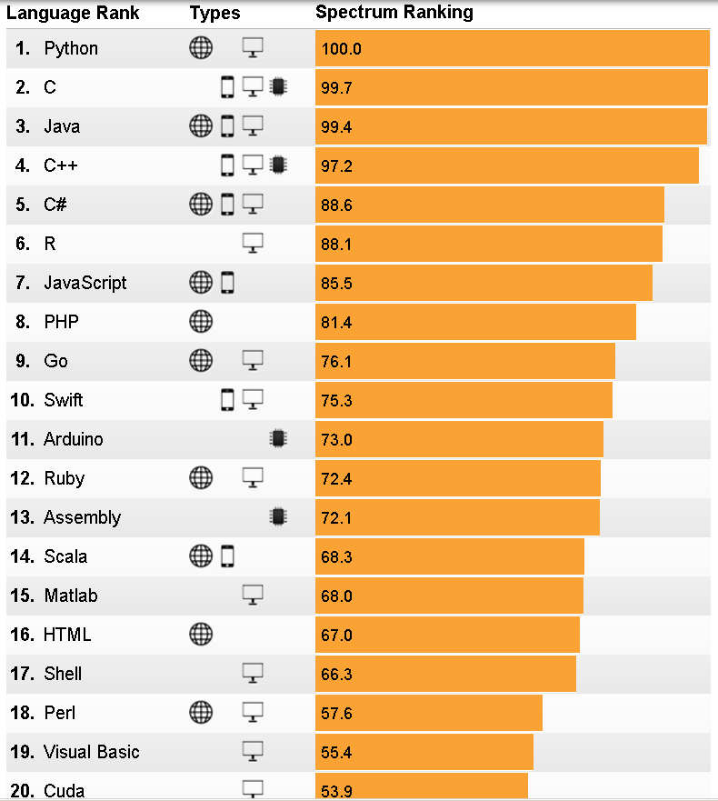
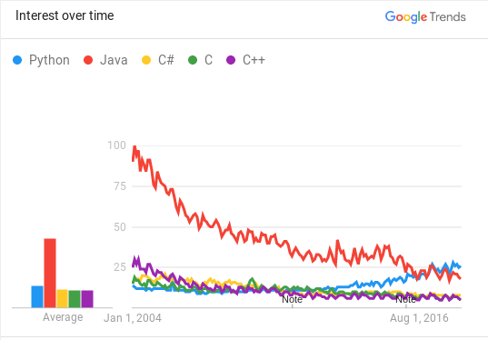

% Modern Language Survey
% Jon Craton

Popular
=======

IEEE Spectrum provides an annual programming language popularity list[2]. This is derived from several difference sources of information on programming languages. Here is their list:

The IEEE methodology is complex, so it is difficult to determine simple strengths and weaknesses. Being an engineering organization, the IEEE results are likely biased towards science and engineering work. We don't see Javascript on this list, although it tops other lists.

Looking at the top 5 from that list using Google Trends can give us a sense for how popular these langauges are over time:

Looking at the Google Trends data, it is clear that web searches for Java have been slowly decresing over the last decade. This is likely linked to a decrease in popularity. Likewise, there has been steady growth in search traffic for Python showing that it has been growing in popularity.

Most Used
=========

The annual StackOverflow user survey is a great source of information about language usage by developers[1]. I don't think this invalidates my ability to use these results here, but I was a participant in this survey I am a moderated on the Stack Exchange network. According to a multiple choice question asking developers (n=78,334) which language they use, these are the most used languages:

- JavaScript - 69.8%
- HTML - 68.5%
- CSS - 65.1%
- SQL - 57.0%
- Java - 45.3%
- Bash/Shell - 39.8%
- Python - 38.8%
- C# - 34.4%
- PHP - 30.7%
- C++ - 25.4%
- C - 23.0%
- TypeScript - 17.4%
- Ruby - 10.1%
- Swift - 8.1%
- Assembly - 7.4%
- Go - 7.1%
- Objective-C - 7.0%
- VB.NET - 6.7%
- R - 6.1%
- Matlab - 5.8%
- VBA - 4.9%
- Kotlin - 4.5%
- Scala - 4.4%
- Groovy - 4.3%
- Perl - 4.2%

Most Installed
==============

1. https://insights.stackoverflow.com/survey/2018/#technology
2. https://spectrum.ieee.org/computing/software/the-2017-top-programming-languages

The landscape of programming languages being used currently is constantly changing.  Often we will see 
articles etc. saying this or that language is the most popular, or is the new big thing, or is where all 
the 
jobs are.  I would 
like you to research this issue
to get a feel for what is the true nature of the use of 
programming languages
.  I want you to go deeper than just finding one article with a list of languages.  
You need to really look at things like w
hat are they basing it on? How extensive is it?  Is it focused 
towards a particular market or industry?
I would like “rankings” (loose interpretation) of the languages (Top 
10 give or take a couple)
addressed 
in separate categories:
a)
Most Popular
b)
Most Use
d
c)
Most installed Base
{this does not enclose things like a compiler that is shipped with every copy 
of an OS ...}
Of course there is going to be a lot of variations on what you find so you will have to do your best to 
weed through all the information.  The
re are many that base everything on the number of 
questions
asked about a language on an online help site, or the number of hits a particular download site has for a 
particular language.  Make sure you take into account what the information you are working
with is 
based on.  It is your job to try and 
distill several sources for this and give your best estimates.  Make sure 
you source your work.  A nice summary of each category (a,b,c) of what you found is expected along 
with the rankings